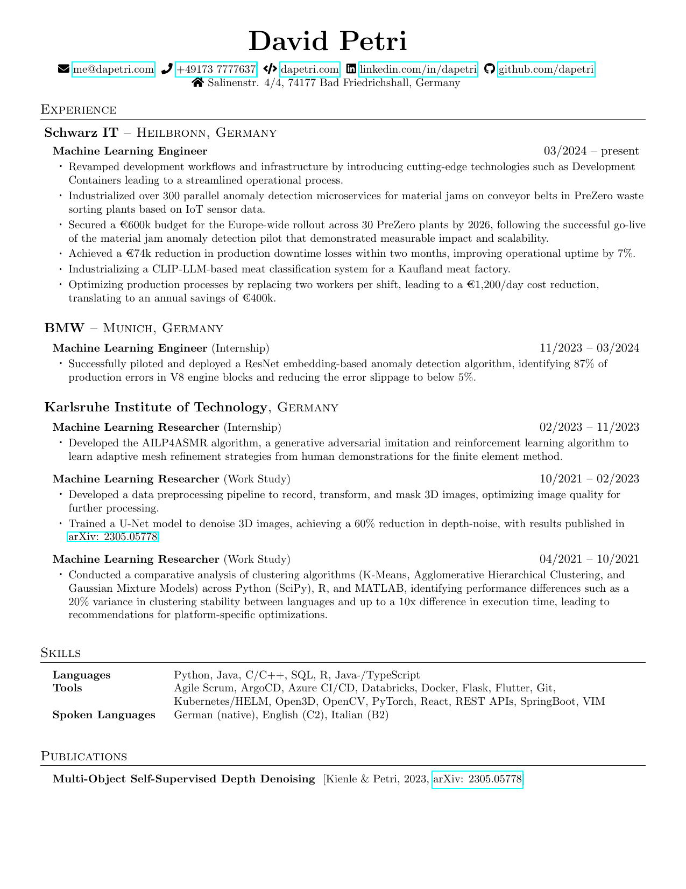

This is the repository for my CV tex files. This project can be build using Overleaf and its GitHub API, from which it can pull and push to this repository.
Also, one can use danteev/texlive:latest ([docker hub link](https://hub.docker.com/r/danteev/texlive/)) and the VSC's latex extension to build and work on this file in VSC.

  

